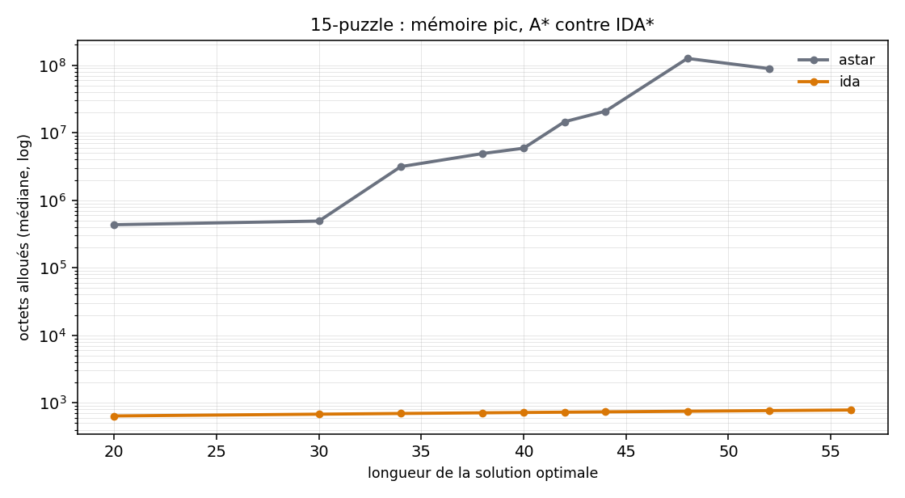
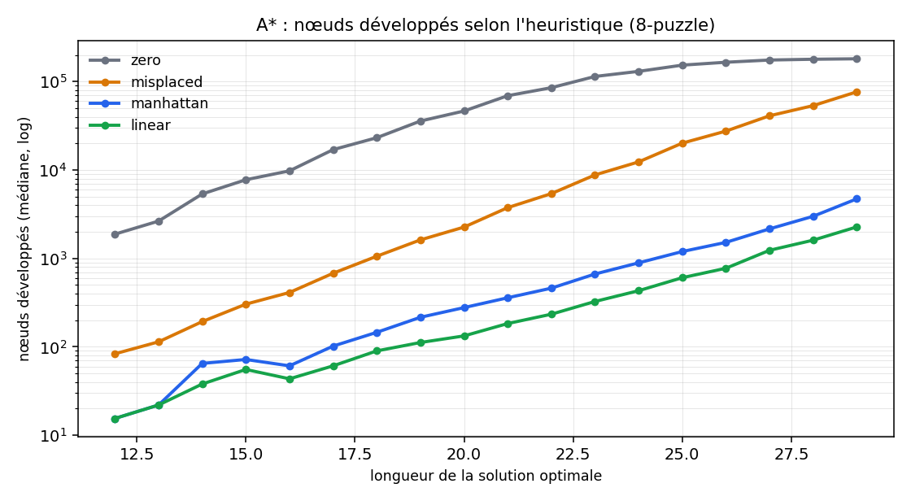
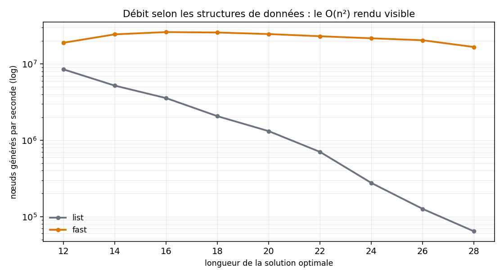

# Taquin — mesurer une recherche heuristique

Un solveur de taquin en C, et surtout le banc de mesure qui va avec. Le projet
part d'un TP d'école (BFS et A\* sur les listes chaînées fournies) et le pousse
jusqu'à des affirmations vérifiables : combien de nœuds coûte une heuristique,
ce que valent vraiment les structures de données, et pourquoi A\* meurt sur le
15-puzzle là où IDA\* passe.

```bash
make && make demo
```

```
taquin 3x3 | algo=astar impl=fast heuristique=manhattan dup=gcompare
run 0    seed=42  ok  len=24  generes=1993  developpes=741  memoire=  95.4 Ko  0.111 ms
...
--- resume sur 20 instance(s) ---
  longueur moyenne    : 22.65 coups
  ecarts a l'oracle   : 0  (toutes les solutions sont optimales)
```

Tous les chiffres de cette page viennent des CSV de [`results/`](results/),
commités. **Vous n'avez rien à lancer pour les vérifier** : chaque tableau cite
sa commande, et `docs/BENCHMARKS.md` est régénéré depuis les CSV, jamais écrit à
la main.

---

## Le 15-puzzle : là où le TP s'arrête

A\* garde tous les nœuds ouverts en mémoire. Sur des instances à ~50 coups,
ça ne passe plus.



| mélange | algo | résolues | longueur médiane | mémoire pic médiane |
|---:|---|---:|---:|---:|
| 60 | `astar` | 10/10 | 38 | 3 072 Ko |
| 60 | `ida` | 10/10 | 38 | 712 o |
| 200 | `astar` | **5/10** | 48 | 122 882 Ko |
| 200 | `ida` | **10/10** | 52 | **768 o** |

```bash
./bin/taquin15 --algo astar --shuffle 200 --runs 10 --max-bytes 536870912
./bin/taquin15 --algo ida   --shuffle 200 --runs 10 --max-nodes 4000000000
```

Les deux bornes ne sont pas les mêmes, et c'est le point : **A\* meurt en
mémoire, IDA\* meurt en temps.** Les borner tous les deux en nœuds générés
inverse le résultat, parce qu'IDA\* les cumule sur toutes ses itérations.

---

## Ce que rapporte une heuristique



| heuristique | nœuds développés (médiane) | rapport à Manhattan |
|---|---:|---:|
| `zero` (A\* dégénéré en coût uniforme) | 90 182 | 175× |
| `misplaced` (tuiles mal placées) | 6 148 | 12× |
| `manhattan` | 514 | 1× |
| `linear` (Manhattan + conflit linéaire) | 250 | 0,49× |

Sur le 15-puzzle, le conflit linéaire divise les nœuds par 9 mais le temps par
1,3 seulement : il coûte cher par nœud. Une heuristique plus informée n'est pas
automatiquement plus rapide.

**A\* développe 176× moins de nœuds que le BFS**, à solution identique. C'est
le BFS qui le prouve : il explore par profondeur croissante, donc sa première
solution est optimale par construction, sans rien supposer de l'heuristique.
`--verify` rejoue chaque instance contre lui.

---

## Ce que valent les structures de données

`popBest` parcourait toute l'open list à chaque extraction, `onList` toute la
liste à chaque test, avec un `memcmp` par nœud. A\* était donc en O(n²).



| structures | nœuds générés | temps total | débit |
|---|---:|---:|---:|
| `list` — les listes du squelette | 879 046 | 6,992 s | 125 713 nœuds/s |
| `fast` — tas binaire + table de hachage | 442 534 | **0,022 s** | **20 209 800 nœuds/s** |

**161× de débit**, à longueur de solution identique. Le débit de la version sur
listes n'est pas une constante : il s'effondre à mesure que les listes
grandissent, ce que montre la pente de la courbe.

---

## Deux choses que la mesure a démenties

**Jeter un doublon sans comparer son `g`** — ce que faisait le code d'origine —
rend une solution non optimale sur **116 instances sur 1 000**. Je m'attendais à
une subtilité théorique ; c'est un bug qui se déclenche une fois sur neuf.

**Le générateur d'instances n'est pas uniforme.** Le graphe du taquin est
biparti : après un nombre pair de coups, la case vide ne peut physiquement pas
être sur un bord. Et à parité fixée, la loi est proportionnelle au degré du
sommet.

| case vide | observé | uniforme | ∝ degré | ∝ degré à parité fixée |
|---|---:|---:|---:|---:|
| coin (×4) | 16,61 à 16,74 % | 11,11 % | 8,33 % | **16,67 %** |
| bord (×4) | **0,00 %** | 11,11 % | 12,50 % | **0,00 %** |
| centre | 33,35 % | 11,11 % | 16,67 % | **33,33 %** |

Khi-deux sur 200 000 tirages : l'uniforme et le ∝ degré sont rejetés
(p < 10⁻³⁰⁰), le ∝ degré à parité fixée passe (χ² = 2,0, p = 0,73).

```bash
./bin/taquin --enumerate          # les 181 440 états, profondeur max 31
./bin/taquin --dist 200000        # les trois hypothèses, testées
```

---

## Utilisation

```bash
make          # compile              (~2 s)
make test     # la suite de tests    (~5 s)
make demo     # 20 instances vérifiées contre l'oracle
make help     # le reste
```

| binaire | rôle |
|---|---|
| `bin/taquin` | le banc de mesure (8-puzzle) |
| `bin/taquin15` | le même en 4×4 (15-puzzle) |
| `bin/taquin_vs` | mode interactif : le joueur affronte A\* |
| `bin/taquin_baseline` | le solveur d'origine, restauré, pour comparaison |

Options principales — `./bin/taquin --help` pour la liste :

```
--algo bfs|astar|ida     --heuristic zero|misplaced|manhattan|linear
--impl list|fast         --dup naive|gcompare
--seed N --runs N --shuffle N --csv FICHIER --verify
--max-nodes N            --max-bytes N
--enumerate              --dist N
```

Toute exécution est reproductible : `--seed N` rejoue exactement la même
instance, sur n'importe quelle machine (le tirage passe par splitmix64, pas par
`rand()`, dont la suite n'est pas spécifiée).

### Régénérer les mesures

```bash
pip install -r bench/requirements.txt
make bench     # ~3 min 30, écrase results/
SCALE=20 make bench   # ~20 s, mêmes graines, échantillons /20
make report    # régénère docs/BENCHMARKS.md et les figures
```

---

## Provenance du code

L'objectif de ce tableau est qu'il n'y ait aucune ambiguïté sur qui a écrit
quoi.

| origine | fichiers | lignes |
|---|---|---:|
| **Squelette fourni par l'école** | `starting-kit/item.h` (16), `starting-kit/list.h` (28), `starting-kit/list.c` (272), `board.h` tel que fourni (26) | **342** |
| **Écrit par moi pour le TP d'origine** | `board.c` (161), `taquin.c` (140), `taquin_vs.c` (174), dans leur version du TP | **475** |
| **Écrit sur ce chantier, en binôme avec un assistant IA** | `puzzle.[ch]`, `heuristic.[ch]`, `node.[ch]`, `pqueue.[ch]`, `hashset.[ch]`, `search.[ch]`, `stats.[ch]`, `enumerate.[ch]`, `taquin.c` réécrit, la suite de tests, le banc | **~3 900** |

Sur ce chantier, j'ai dirigé le découpage en phases, arbitré les décisions de
conception consignées dans [`docs/DESIGN.md`](docs/DESIGN.md), et tranché les
questions que la relecture a soulevées. Le code lui-même a été écrit en binôme
avec Claude. Je préfère le dire que le laisser deviner : les décisions sont
défendables, et c'est sur elles que je réponds.

La répartition entre les deux premières lignes est **déclarée**, non déduite :
le premier commit du dépôt contient déjà le TP terminé, donc l'historique Git ne
peut pas trancher.

---

## Pour aller plus loin

- [`docs/QUESTIONS.md`](docs/QUESTIONS.md) — les six questions classiques
  (admissibilité, consistance, conflit linéaire, doublons, ré-exploration
  d'IDA\*, uniformité du générateur), répondues avec les chiffres du banc.
- [`docs/BENCHMARKS.md`](docs/BENCHMARKS.md) — tous les tableaux, générés.
- [`docs/DESIGN.md`](docs/DESIGN.md) — les décisions de conception et leurs
  raisons.
- [`docs/RETROSPECTIVE.md`](docs/RETROSPECTIVE.md) — ce qui a raté, sans le
  lisser.

---

**Omar Benjelloun** — 2026
